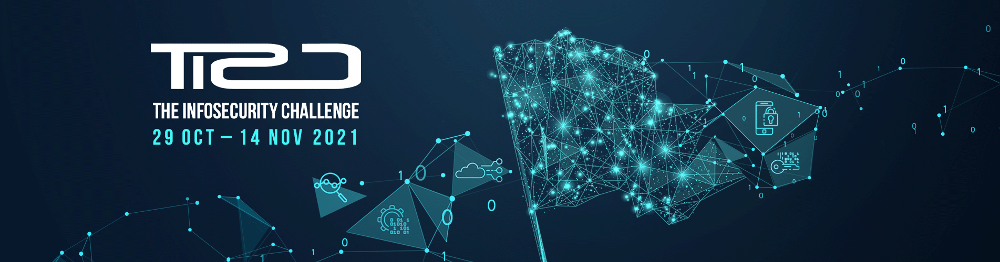

# CSIT The InfoSecurity Challenge (TISC) 2021

It contains a series of challenges from level 1-10 for Cybersecurity experts to complete in order to put a halt to PALINDROME's operations. The levels covered topics from Web Pen-testing, Forensics, Reverse Engineering, Binary Exploitation, Cryptography, Mobile Security and IoT.

For this competition, I solved 2 challenges only. I will try harder next year!

## Badge of Participation

<figure><figcaption></figcaption></figure>

Verify the badge [here](https://api.badgr.io/public/assertions/9bopsgcbSISQDXj0oVu1qg?identity\_\_email=gadiellaurz%40gmail.com).

## Scratching the Surface - Challenge 2

.png>)

For this challenge, we were given a JPG image file. The challenge description asked for the modify time of the photograph.

First thing I thought was that I could probably just right click the file, go to properties > details, and perhaps I could find some useful information there. However, this did not work as the modify time was removed from the image.

Next, I decided to try an online exif tool. You can use Google and find any exif tool/ exif viewer/ metadata viewer which works for you.

After we upload the image on the online exif tool site, we will get the flag.

.png>)

From here, I also found 2 other ways that could solve this challenge. This next solution is to use [CyberChef](https://cyberchef.org/).&#x20;

We could upload the image on [CyberChef](https://cyberchef.org/), which will show us the modify date. However, the modify date does not look like it is in the correct format.

.png>)

We could get these numbers provided in the `ModifyDate` and translate the date time format as shown in the image below. This would give us the flag as well.

.png>)

The last solution I found is using [`FTK Imager`](https://accessdata.com/product-download/ftk-imager-version-4-5). This might be a bit of an "overkill" solution.

First, we could save this file into a folder.

Next, we launch FTK Imager and go to `file > add evidence item > Contents of a folder > browse to the folder containing the file`

If we click on the image in the file list, we will see the flag appearing at the bottom.

.png>)

Flag: TISC{2003:08:25 14:55:27}

## Scratching the Surface - Challenge 3

.png>)

In this challenge we were given a JPG image. What I thought was that this could be Steganography related challenge, which is hiding information inside the image.

I proceeded to use `stegoveritas` which I had installed on my Kali Linux VM. StegoVeritas is basically an easy to use steganography tool which had helped me solve various steganography related challenges in the past. These challenges writeups can be found [here](https://gadiel-lau.gitbook.io/2020-writeups/gsctf-2020#wheres-the-file) and [here](https://gadiel-lau.gitbook.io/2020-writeups/brixel-ctf-winter-edition-2020/steganography#rufus-the-vampire-cat).

We use the stegoveritas \<filename> command and we get the results where a JPG image was extracted.

.png>)

From here, I used `strings` command to print out readable strings from the JPG image data.

.png>)

At a glance, the first line of text caught my attention. It looked like there is a shift in characters. What are the popular shift ciphers? My first thought was rot13. Going to this online[ site](https://rot13.com/), we can convert it back to plaintext.

.png>)

If you are interested, you could also check out my other writeup [here](https://gadiel-lau.gitbook.io/2020-writeups/govtech-stack-the-flags-ctf-2020/misc#fwo-fwf). The last part involved decoding rot13 as well. With CTF experience, it is not difficult to tell when there is a shift in characters :)

Flag: TISC{APPLECARROTPEAR}
