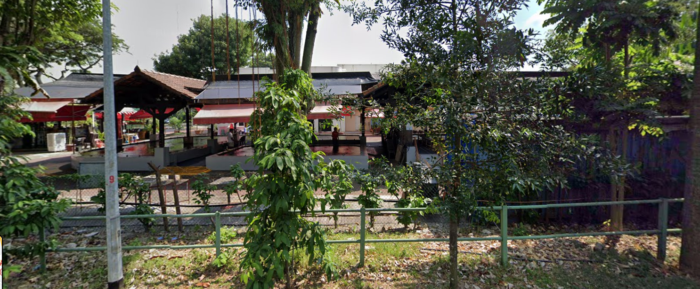

# COMMUNITY MAJOR(SEETF)

More details about SEETF 2022 can be found on [CTFtime](https://ctftime.org/event/1543/). Categories include web exploitation, binary exploitation, reverse engineering, forensics, cryptography and more.

I solved 3 MISC, 1 Web and 1 OSINT challenge. The `Join our Discord` and `Survey` challenges are like free points giveaway, so I will only do writeups for the others.

 (1).png>)

.png>)

## Sourceless Guessy Web (Baby Flag)

.png>)

This challenge description provided us with a link to read up more on `file path traversal`.&#x20;

If I include this query

`?page=../../../etc/password`

It would take me to another site where I could `F12` to inspect elements and find the flag there.

.png>)

Flag: SEE{2nd\_fl4g\_n33ds\_RCE\_good\_luck\_h4x0r}

## Regex101

.png>)

For this challenge, we were given a `misc_regex101.zip` file.&#x20;

First, we could unzip this file using the `7z x` command.

.png>)

This would extract a `distrib` folder containing `flags.txt` file.&#x20;

If we go into `flags.txt`, we would see 2999 flags inside.&#x20;

.png>)

We need the correct flag which is 5 uppercase letters, followed by 5 digits, and another 6 uppercase letters. We could use an [online regular expression site](https://regex101.com/) to verify our regex.&#x20;

I would be covering 3 different ways on how you could solve this.

1. Using Command Line Interface (CLI) / terminal
2. Using Text Editor like [Sublime Text](https://www.sublimetext.com/)
3. Using [CyberChef](https://cyberchef.org/)
4. Using a Python Script

1.On the terminal, we could use this command to get the flag.

`cat flags.txt | grep -E SEE{[A-Z]{5}[0-9]{5}[A-Z]{6}}`

`-E` option stands for regular expression

 (1).png>)

2\. Using [Sublime Text](https://www.sublimetext.com/), we can `CTRL+F` then input `SEE{[A-Z]{5}\d{5}[A-Z]{6}}` into the search field, click on `Regular expression` or `ALT+R` and click `Find`

.png>)

3\. Using [CyberChef](https://cyberchef.org/), we could copy paste the 2999 flags into the input, use the `Regular expression` operation and input `SEE{[A-Z]{5}\d{5}[A-Z]{6}}`. Using this [recipe](https://cyberchef.org/#recipe=Regular\_expression\('Strings','SEE%7B%5BA-Z%5D%7B5%7D%5C%5Cd%7B5%7D%5BA-Z%5D%7B6%7D%7D',true,true,false,false,false,false,'List%20matches'\)), we would get the flag.

.png>)

4\. Using a python script, we could search through the flags with the regular expression. Refer to [Python Regex](https://www.w3schools.com/python/python\_regex.asp) for quick reference.

```python
import re #to use regular expression package
dictionary = open("flags.txt","r") #to open password list file
extracted = open("flag_out.txt","w") #to write extracted passwords into a file
rex = re.compile("SEE{[A-Z]{5}\d{5}[A-Z]{6}}") # input regular expression 
passwords = filter(rex.search, dictionary) #search the password using the regular expression provided
for line in passwords:
 extracted.write(line)
dictionary.close()
extracted.close()
```

We could run the Python script and view the flag in `flag_out.txt`.

.png>)

Flag: SEE{RGSXG13841KLWIUO}

## Everyone Needs a Break

 (1).png>)

For this challenge, we were given this `challenge.png` image.



If we search on google : `where can feed birds in Singapore`, we will find `Jurong bird park`.

Notice in the image, it looks like a fishing village.

If we look around Google Maps, we will find this fishing village nearby. The flag is the postal code.

.png>)

Flag: SEE{629143}

## Sniffed Traffic

.png>)

For this challenge, we were given a `forensics.pcapng` file.&#x20;

First, lets analyze this file in [Wireshark](https://www.wireshark.org/).&#x20;

The challenge description mentioned about someone downloading a file .&#x20;

We could go file, `Export objects > HTTP`\


.png>)

There are a list of contents, but notice there is a zip file. We could save this zip file.

 (1).png>)

After saving the file, we could try to extract the zip file. However, we cannot extract the zip file because it is password protected.

.png>)

At this point, we could try to crack the password of the zip file like how we did it in [MAJOR 1's challenge](https://gadiel-lau.gitbook.io/2022-writeups/sit-n0h4ts-cyber-league-2022/major-1#understand-space-politics), but we would soon realise that after hours... the password still cannot be cracked.

.png>)

Now, if we go back to Wireshark, we could go to `Statistics` and then `Protocol Hierarchy`.

.png>)

Notice there are some `Data`

.png>)

We could apply this filter in the filter box

`data && tcp`

.png>)

Next, we right click on the first packet, `Follow > TCP Stream`

.png>)

Here we could see the password of the zip file

.png>)

Now we could extract the file in `thingamajig.zip`.

.png>)

After we extract `stuff` from `thingamajig.zip`, we could run `file` to check the type of file data. Then, I used [`foremost`](https://www.kali.org/tools/foremost/) to extract the contents. Alternatively, [Binwalk](https://en.kali.tools/?p=1634) could be used too. If you are interested, you could read my writeups [here](https://gadiel-lau.gitbook.io/2020-writeups/brixel-ctf-winter-edition-2020/steganography#doc-ception), [here ](https://gadiel-lau.gitbook.io/2022-writeups/lagncrash-interpoly-ctf-2022#s3crethero)and [here ](https://gadiel-lau.gitbook.io/2022-writeups/sg-cyber-olympian-trials-2022#hidden-file)where I used Binwalk to solve them. &#x20;

.png>)

After extracting, I could `cd` to the output directory and try to unzip a zip file. This zip file requires a password to unzip as well.

.png>)

Now, we just use [John](https://en.wikipedia.org/wiki/John\_the\_Ripper) to crack the password like how we did it in [here ](https://gadiel-lau.gitbook.io/2020-writeups/csit-infosecurity-challenge-2020#stage-1-what-is-this-thing)and [here](https://gadiel-lau.gitbook.io/2022-writeups/sit-n0h4ts-cyber-league-2022/major-1#understand-space-politics).

.png>)

Alternatively, we could use [fcrackzip](https://www.kali.org/tools/fcrackzip/) and `rockyou.txt` wordlist to crack the password.

```
└─$ fcrackzip -u -D -p /usr/share/wordlists/rockyou.txt 00000001.zip                                                   130 ⨯


PASSWORD FOUND!!!!: pw == john
```

Now that we have cracked the password, we can use the password: john to unzip the zip file. Then, we just use `cat` to read the contents of `flag.txt`, which gives us the flag.

.png>)

Flag: SEE{w1r35haRk\__d0dod0_\_4c87be4cd5e37eb1e9a676e110fe59e3}

If you are interested in other writeups where I used Wireshark, check out [here](https://gadiel-lau.gitbook.io/2021-writeups/red-alpha-online-challenge#first-stage), [here ](https://gadiel-lau.gitbook.io/2022-writeups/lagncrash-interpoly-ctf-2022#nothing-here)and [here](https://gadiel-lau.gitbook.io/2022-writeups/nus-greyhats-grey-cat-the-flag-2022#image-upload).

SEETF 2022 Writeups done by other participants can be found [here](https://docs.google.com/spreadsheets/d/12a7onACZZQLCvL7AdhBUUDV2OOo0AEXhlsNNXVWrSJ4/edit#gid=0).
