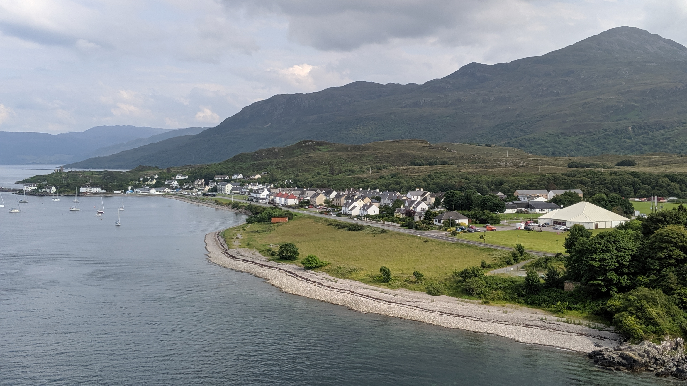

# MAJOR 2

In Major 2, there were 660 registered teams in Major 2. Out of 660 teams, 36 teams managed to get at least one solve or more.&#x20;

I managed to solve 3 challenges from the forensics and cryptography categories. I also first blood one of the challenges in around 3 minutes. Furthermore, I was the first to solve a challenge in this CTF.

<figure><figcaption></figcaption></figure>

Once I first blood the challenge, it was announced on the Discord channel as well.

<figure><figcaption></figcaption></figure>

## Where is this?

<figure><figcaption></figcaption></figure>

For this challenge, it was under the forensics category. I went straight for it once the CTF started as it was my favorite category and what I have interest in. Like mentioned before, I first blood this challenge under team `Tricksters404` and solved it within minutes.

<figure><figcaption></figcaption></figure>

Honestly, I did not expect to first blood this challenge because the first one minute or so there was either some network issue or the infrastructure was having some issue and the challenges did not load.

After a minute or two, I started to work on this challenge and realized that it could be similar to the challenge I solved in [DownUnder2022 ](https://gadiel-lau.gitbook.io/2022-writeups/downunderctf-2022#birds-eye-view)few hours before.

This challenge provided us with a picture and we are required to find out the place.&#x20;

<figure><figcaption></figcaption></figure>

Of course, I had no idea where this was. Right off the bat, I applied a similar approach as how I solved the similar challenge in DownUnder 2022 CTF.

Instead of using an online exif tool, I used the `exiftool` command on my Kali machine.

This would give us the metadata of the image, which included the `GPS Position` which is crucial for us to find out the location of this place.

<figure><figcaption></figcaption></figure>

With these values, we could find the location of the image by keying in the `Longitude` and `Latitude` [here](https://www.gps-coordinates.net/).

<figure><figcaption></figcaption></figure>

After clicking `Get Address`, we would get the location.

<figure><figcaption></figcaption></figure>

However, sometimes the location is not 100% accurate. To confirm that I got the correct location, I Googled the location `Kyleakin`. This will give us the following result.

<figure><figcaption></figcaption></figure>

Indeed, it is the correct location. As you can tell, this is a really simple challenge and because I had just practiced solving a similar challenge, it was solved within a few minutes.

Flag: CYBERLEAGUE{kyleakin}

## Spinning Round & Round

<figure><figcaption></figcaption></figure>

For this challenge, it was under the cryptography category. We were given a MP4 file which shows a video of a series of characters rotating.

<figure><figcaption></figcaption></figure>

After a few seconds, it will start to rotate.

<figure><figcaption></figcaption></figure>

My initial thought is that this could potentially be the flag, except the characters are rotated by certain number of places.

If we were to try `ROT13`, which is usually the most commonly cipher, we will not get the flag.

However, using an [online ROT cipher decoder](https://www.dcode.fr/rot-cipher) would solve the challenge. It was actually using `ROT7` instead of the commonly used `ROT13`.

<figure><figcaption></figcaption></figure>

Flag: CYBERLEAGUE{ROTATE\_UR\_ALHPA}

## Choo Choo!

<figure><figcaption></figcaption></figure>

For this challenge, it was under the Cryptography category. We were given a `mp4` file.&#x20;

If we play the file, we would see a moving train with characters on the train.

<figure><figcaption>
Flag Part 1
</figcaption></figure>

<figure><figcaption>
Flag Part 2
</figcaption></figure>

<figure><figcaption>
Flag Part 3
</figcaption></figure>

The 3 images above would suggest that it is likely the flag when combined. However, the challenge is clearly not as easy as just typing out the characters we see on the train. The message on the train is likely to be encoded in some kind of cipher.

If we do a Google search on `train cipher`, we would find `Rail fence cipher`. We could use an online tool [here ](https://www.boxentriq.com/code-breaking/rail-fence-cipher) or [CyberChef](https://cyberchef.org/#recipe=Rail\_Fence\_Cipher\_Decode\(4,0\)\&input=Q0VAcjNZTEF7bjNfaHJCUkdF2GgkcH1FVVQh). If you noticed, at the start of the train, it indicated `four` which likely suggests that it is using key: `4`.

This challenge actually got a bit annoying because there was this character: `Ø` which looked like O or 0 with a slash through the character. After several failed attempts to solve the challenge due to the confusion of characters, a hint was released to the public.

<figure><figcaption></figcaption></figure>

Changing the character with slash to `0` would give us the flag.

Flag: CYBERLEAGUE{@n0Th3r\_$!ph3r}

## Check m8

<figure><figcaption></figcaption></figure>

For this challenge, it was under the MISC category. I solved this challenge after the competition ended.&#x20;

We were given a `.txt` file and opening it reveals what seemed like chess moves of a game played.

1. f4 g6 2. a3 h6 3. c4 Na6 4. a4 Nc5 5. Nf3 Ne6 6. Qc2 Nc5 7. h4 c6 8. d4 Ne6 9. Ng1 f5 10. d5 Ng7 11. Nh3 Nh5 12. Kf2 Rh7 13. a5 d6 14. Qa4 Qc7 15. Rh2 b5 16. Qd1 Bd7 17. Ng1 Rg7 18. Rh3 Nhf6 19. h5 Nh7 20. Qd2 Qb8 21. Nf3 Qb7 22. Rg3 g5 23. Nc3 Bc8 24. fxg5 Qd7 25. g6 Nhf6 26. Rh3 Ba6 27. Qd4 c5 28. Qd1 b4 29. Na2 Rb8 30. Rh4 Rb7 31. e3 Rb8 32. Nd2 { Black resigns. } 1-0

This is my first time attempting such a challenge and had no clear direction on how to proceed. I did some searching online and tried to analyze the chess moves manually [here](https://www.chess.com/analysis). For someone like me who is not too familiar with chess moves, I had to read up on the chess notations [here](https://www.chesshouse.com/blogs/education/how-to-read-and-write-algebraic-chess-notation).&#x20;

After some time, I came across this [website](https://puzzling.stackexchange.com/questions/101657/playing-with-a-chess-cipher) which is about `playing with chess cipher`. However, that was not the way to solve the challenge. If I played the game manually on the chess board, there would only be 1 capture on move 24.

<figure><figcaption></figcaption></figure>

This suggest that it is not possible that the message is derived based on the capture itself. Moving on, I tried other ways such as decoding the cipher on [dCode](https://www.dcode.fr/san-chess-notation). Also, I played the whole game manually which would give this result.

<figure><figcaption></figcaption></figure>

This seemed like a dead end.. At this point, I chanced upon [`Stycan Cipher`](https://www.wattpad.com/959045272-%F0%9D%90%82%F0%9D%90%A8%F0%9D%90%9D%F0%9D%90%9E%F0%9D%90%AC-%F0%9D%90%9A%F0%9D%90%A7%F0%9D%90%9D-%F0%9D%90%82%F0%9D%90%A2%F0%9D%90%A9%F0%9D%90%A1%F0%9D%90%9E%F0%9D%90%AB%F0%9D%90%AC-%F0%9D%90%92%F0%9D%90%AD%F0%9D%90%B2%F0%9D%90%9C%F0%9D%90%9A%F0%9D%90%A7-%F0%9D%90%82%F0%9D%90%A2%F0%9D%90%A9%F0%9D%90%A1%F0%9D%90%9E%F0%9D%90%AB), which is a homophonic substitution cipher that encrypts letters and numbers with the possible moves during a chess game. However, I felt like I was going in the wrong direction, further away from solving this challenge.

Finally, I thought that this could be some kind of `Steganography` challenge where messages are hidden within another message. I went to search on `Chess Steganography` and found this [site](https://incoherency.co.uk/chess-steg/), which effectively helped to solve the challenge.&#x20;

Pasting in the cipher message into the `Chess game PGN...` text area and clicking on `Unsteg without blunders` would give us the flag.

<figure><figcaption></figcaption></figure>

Flag: CYBERLEAGUE{qu33ns\_gambit}
